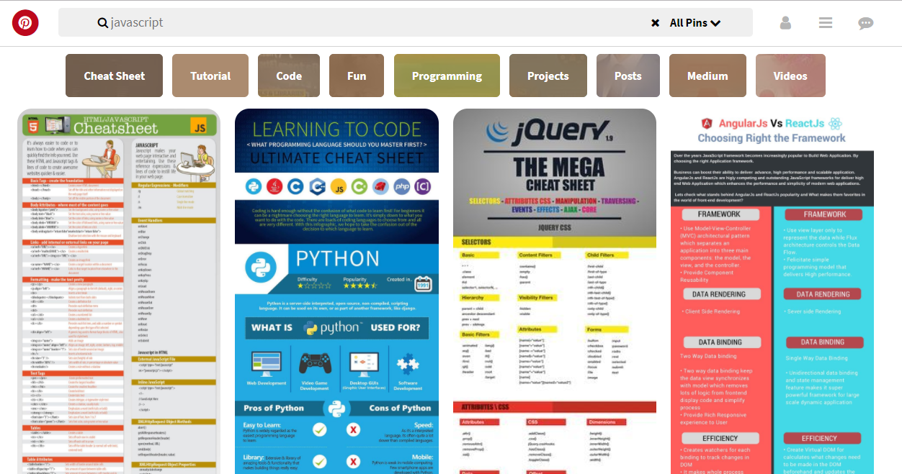

## Pinterest

## Objetivo Funcional

Réplica de la página Pinterest como en la siguiente imagen:

Objetivo Tecnico

Poner en practica el ejercicio aplicando nuestros conocimientos en CSS3.

Herramientas

Editor Visual Studio Code
HTML5
CSS3
